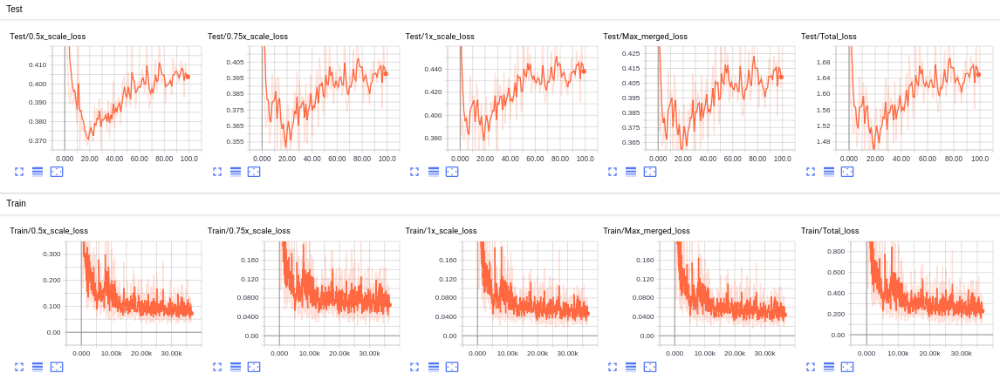
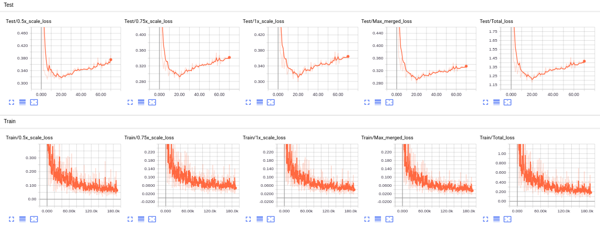
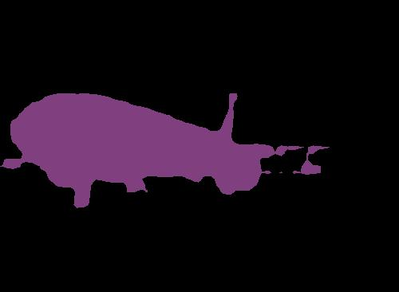
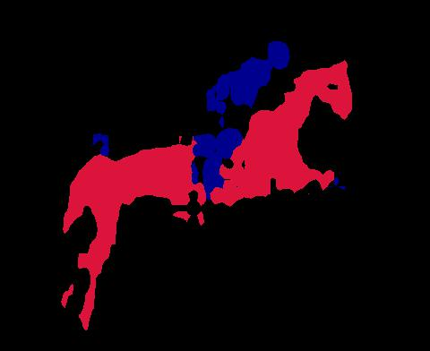
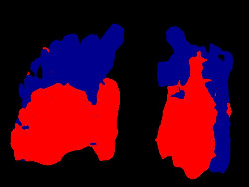
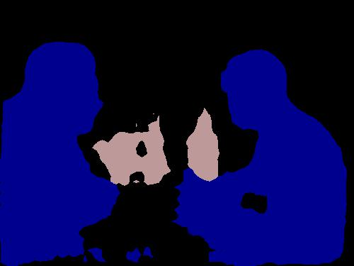

# [PYTORCH] Deeplab

## Introduction

Here is my pytorch implementation of the model described in the paper **DeepLab: Semantic Image Segmentation with Deep Convolutional Nets, Atrous Convolution, and Fully Connected CRFs** [paper](https://arxiv.org/abs/1606.00915). 

## How to use my code

With my code, you can:
* **Train your model from scratch**
* **Train your model with my trained model**
* **Evaluate test images with either my trained model or yours**

## Requirements:

* **python 3.6**
* **pytorch 0.4**
* **opencv (cv2)**
* **tensorboard**
* **tensorboardX** (This library could be skipped if you do not use SummaryWriter)
* **torchvision**
* **PIL**
* **numpy**

## Datasets:

I used 2 different datases: VOC2012 and VOCaugmented (VOC2007 + 2012) Statistics of datasets I used for experiments is shown below

| Dataset                | #Classes | #Train images | #Validation images |
|------------------------|:----------:|:---------------:|:--------------------:|
| VOC2012                |    20    |      5011     |        1449        |
| VOCaugmented           |    20    |      1464     |        1449        |

Create a data folder under the repository,

```
cd {repo_root}
mkdir data
```

- **VOC**:
  Download the voc images and annotations from [VOC2007](http://host.robots.ox.ac.uk/pascal/VOC/voc2007) or [VOC2012](http://host.robots.ox.ac.uk/pascal/VOC/voc2012). Make sure to put the files as the following structure:
  ```
  VOCDevkit
  ├── VOC2007
  │   ├── Annotations  
  │   ├── ImageSets
  │   ├── JPEGImages
  │   └── ...
  ├── VOC2012
  │   ├── Annotations  
  │   ├── ImageSets
  │   ├── JPEGImages
  │   └── ...
  └── VOCaugmented
      ├── gt  
      ├── img
      ├── list
      └── ...
  ```
Note: You need to put ALL images from 2 dataset VOC2007 and VOC2012 into folder **VOCdevkit/VOCaugmented/img/**

* In my implementation, in every epoch, the model is saved only when its loss is the lowest one so far. You could also use early stopping, which could be triggered by specifying a positive integer value for parameter **es_patience**, to stop training process when validation loss has not been improved for **es_patience** epoches.

## Trained models

You could find all trained models I have trained in [Deeplab trained models](https://drive.google.com/open?id=1haaIxDJTEfV6ZndgHAzFp_UavDz72nvx)

## Training

I provide my pre-trained model name **vietnh_trained_deeplab_voc**. You could put it in the folder **trained_models/**, and load it before training your new model, for faster convergence.

If you want to train a new model, you could run:
- **python3 train_voc.py --dataset dataset**: For example, python train_voc.py --dataset augmentedvoc

## Test

By default, my test script will load trained model from folder **trained_models/**. You of course could change it to other folder which contains your trained model(s).

I provide 2 different test scripts:

If you want to test a trained model with a standard VOC dataset, you could run:
- **python3 test_voc.py --year year**: For example, python3 test_voc.py --year 2012

If you want to test a model with some images, you could put them into the folder **test_images/**, then run:
- **python3 test_voc_single_images.py --input --output path/to/output/folder**: For example, python3 test_voc_single_images.py --output predictions. For easy comparison, not only output images are created, but input images are also copied to output folder

## Experiments:

I trained models in 2 machines, one with NVIDIA TITAN X 12gb GPU and the other with NVIDIA quadro 6000 24gb GPU.

The training/test loss curves for each experiment are shown below:

- **VOC2012**

- **VOCaugmented**


## Results

Some output predictions for experiments for each dataset are shown below:

- **VOC2012**

  
  
  

- **VOCaugmented**

  
  
  
